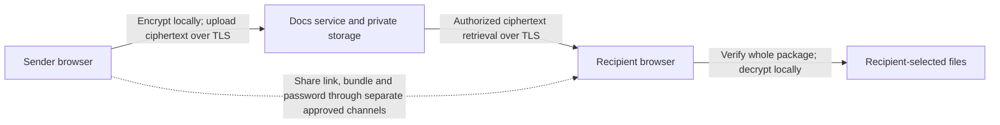

# Docs signed by Sharkbait: PII protection and compliance support

**Audience:** business owners, support teams, customers and security reviewers.

**Reviewed:** September 13, 2026. **Implementation baseline:** [0010d74](https://github.com/atwin140/secure-delivery/commit/0010d743002335f42534e65d7a730ac3a24c9935).

## The business case

**Docs provides stronger control over sensitive document delivery than simply emailing readable PII attachments.** Documents are encrypted in the sender's browser, stored as ciphertext, and decrypted in the recipient's browser. The service does not receive the document key, bundle password or readable document content. Access expires seven days after finalization, and the sender can revoke future retrieval sooner. This reduces where readable personally identifiable information (PII) accumulates and provides a delivery lifecycle that support teams can investigate. [Application architecture](docs/architecture.md), [encryption protocol](docs/protocol.md).

These safeguards support selected **SOC 2 Trust Services Criteria and NIST security/privacy objectives**, and are consistent with DoD guidance to protect sensitive information during sharing. **The current application is not demonstrated to be SOC 2 attested, fully NIST compliant, CMMC compliant or DoD authorized.** The most significant DoD/CUI gaps are documented cryptographic-module validation, identity/MFA enforcement and approval of the complete operating environment. The mappings below explain both the contribution and its limits.

## Why use it instead of ordinary email attachments?

The comparison is to an attachment readable by anyone who gains access to the receiving mailbox, without separate message-level encryption or rights management. Email can be secured: NIST distinguishes transport protection using TLS from content protection using S/MIME. Managed encrypted email, DLP and rights-management products may provide comparable or additional controls; this brief does not rank Docs above those systems. [NIST SP 800-177 Rev. 1, Trustworthy Email](https://csrc.nist.gov/pubs/sp/800/177/r1/final).

| Practical concern                   | Ordinary readable attachment                                                                | What Docs changes                                                                                                                                                         |
| ----------------------------------- | ------------------------------------------------------------------------------------------- | ------------------------------------------------------------------------------------------------------------------------------------------------------------------------- |
| Mailbox or storage exposure         | Readable copies can accumulate in sent mail, inboxes, forwards and archives.                | The document is not an email attachment. Application storage holds ciphertext; document keys and passwords stay outside the service.                                      |
| A link reaches the wrong person     | A misaddressed readable attachment exposes its content immediately.                         | A Docs link alone cannot decrypt the package. The separate key bundle and password are also needed. This benefit depends on distributing them separately.                 |
| Access after the business need ends | A delivered attachment has no dependable central withdrawal mechanism.                      | The server denies retrieval after expiry or sender revocation; reissuing a link invalidates earlier links.                                                                |
| Unnecessary retained copies         | Copies persist according to multiple mailbox and backup policies.                           | The document bucket is excluded from backups and retained versions by design, with cleanup of invalidated objects. Actual storage deletion still needs operational proof. |
| Tampered documents                  | Ordinary attachments do not necessarily carry application-verified cryptographic integrity. | The browser authenticates and validates the complete encrypted package before enabling plaintext output.                                                                  |
| Support investigation               | Mail records describe message handling, not a controlled document-delivery lifecycle.       | Docs records creation, finalization, revocation and ciphertext retrieval events without recording document content. These are not recipient read receipts.                |

For example, if an inbox containing a W-9 attachment is compromised, its tax information may be immediately readable. If the inbox contains only a Docs link and the key material was shared through independent approved channels, that link is insufficient to read the document. This is a narrower exposure scenario, not a guarantee against compromise of all channels or the recipient's device.

The comparison describes mechanisms in the [architecture](docs/architecture.md) and [user guide](docs/user-guide.md). Recorded [browser evidence](evidence/docs/browser-workflow.json) covers role/ownership denial, encryption, verification and revoked retrieval using synthetic documents.

**Important limits:** expiry and revocation govern future server access; they cannot erase downloaded ciphertext, plaintext or screenshots. Recipients can forward all access material. The service cannot verify a named recipient's identity, inspect encrypted files for malware, or protect a compromised browser. A compromised server that delivers malicious JavaScript can also defeat browser-side secrecy. “Signed by Sharkbait” is branding, not a digital signature or proof of authorship. [Threat boundaries](docs/architecture.md), [protocol limitations](docs/protocol.md).

## How it supports SOC 2

SOC 2 evaluates controls over a defined service organization's system; it is not a product feature checklist. An applicable CPA examination and supporting organizational evidence are needed for an attestation claim. The following associations are **engineering interpretations of selected criteria**, not an auditor's determination. [AICPA SOC services](https://www.aicpa-cima.com/resources/landing/system-and-organization-controls-soc-suite-of-services), [AICPA Trust Services Criteria, revised points of focus 2022](https://www.aicpa-cima.com/resources/download/2017-trust-services-criteria-with-revised-points-of-focus-2022).

| Selected criteria                              | Contribution from Docs                                                                                              | What the organization must still establish                                                                                        |
| ---------------------------------------------- | ------------------------------------------------------------------------------------------------------------------- | --------------------------------------------------------------------------------------------------------------------------------- |
| **CC6.1, CC6.3 — logical access**              | Keycloak sender sign-in, required sender role, ownership checks, short sessions and restricted workload privileges. | Individual account ownership, access approvals/reviews, deprovisioning and appropriate MFA. Recipient access is possession-based. |
| **CC6.6, CC6.7 — boundaries and transmission** | Browser encryption, verified TLS, private storage and network policies.                                             | Evidence that every deployed connection, network boundary and administrator access path is protected and monitored.               |
| **C1.1, C1.2 — confidentiality lifecycle**     | Ciphertext-only document storage, encrypted filenames, expiry, revocation and deletion workflows.                   | Classification, permitted disclosures, retention decisions, backup exclusions and proven disposal outcomes.                       |
| **CC7.2, CC7.4 — monitoring and response**     | Delivery events, cleanup metrics, revocation and an emergency retrieval switch.                                     | Protected/centralized logs, alert review, incident ownership and exercised response procedures.                                   |
| **CC8.1 — change management**                  | Versioned source, locked dependencies, tests, immutable image references and a CI workflow.                         | Review/approval records, protected release processes, scanning and sustained operational evidence.                                |

Supporting source/test references and broader availability considerations are in [SOC 2 evidence preparation](docs/soc2-evidence.md). The Privacy category also covers organizational practices such as notice, choice, permitted use and disclosure; encryption alone does not establish those outcomes. [AICPA privacy considerations](https://www.aicpa-cima.com/resources/download/privacy-considerations-in-a-soc-2-r-examination).

## How it supports NIST guidance

NIST SP 800-122 recommends context-appropriate safeguards for PII, including limiting unnecessary collection/retention, controlling access, protecting transmission and preparing for incidents. Docs contributes by reducing readable server-held content and enforcing a limited delivery lifetime. The organization still determines the sensitivity, purpose and permitted recipients. [NIST SP 800-122, Sections 3–5](https://nvlpubs.nist.gov/nistpubs/Legacy/SP/nistspecialpublication800-122.pdf).

For a high-level NIST CSF 2.0 profile, the design contributes to **PR.AA-05** (access permissions), **PR.DS-01/02** (stored/transmitted data protection), **PR.PS-04** (logs) and **PR.IR-01** (network protection). These are partial contributions: the CSF describes organizational outcomes, including governance and monitoring, that this application cannot provide by itself. [NIST CSF 2.0, Appendix A](https://nvlpubs.nist.gov/nistpubs/CSWP/NIST.CSWP.29.pdf).

A more specific, non-exhaustive mapping to [NIST SP 800-53 Rev. 5](https://csrc.nist.gov/pubs/sp/800/53/r5/upd1/final) is:

| Control references                                               | Application contribution                                                                                                | Remaining assessment boundary                                                                                                                                            |
| ---------------------------------------------------------------- | ----------------------------------------------------------------------------------------------------------------------- | ------------------------------------------------------------------------------------------------------------------------------------------------------------------------ |
| **AC-3, AC-6** — authorization and least privilege               | Sender role/ownership enforcement and limited service-account permissions.                                              | Personnel/device authorization, account lifecycle and recipient identity assurance.                                                                                      |
| **SC-8, SC-28** — transmission and stored-information protection | Verified TLS plus encrypted packages, with keys outside server storage.                                                 | All infrastructure/metadata paths, endpoint safeguards and required cryptographic assurance. See the FIPS gap below.                                                     |
| **AU-2, AU-3** — security events and record content              | Allowlisted delivery events with timestamps, identifiers and outcomes.                                                  | Required event coverage, attributable identities, log protection and review.                                                                                             |
| **CM-3, CM-6** — controlled changes and configuration            | Source history, deployment configuration, pinned artifacts and regression tests.                                        | Approved baselines, change authorization and continuing configuration checks.                                                                                            |
| **SI-12** — information lifecycle                                | Expiry and cleanup workflows; minimal document metadata at the server.                                                  | Applicable record schedules, legal holds and evidence of actual removal.                                                                                                 |
| **CP-9, CP-10** — backup and recovery                            | Daily application-metadata backups and restore invalidation that prevents old deliveries from becoming available again. | Off-cluster backup protection, separate Keycloak recovery and tested recovery objectives. Documents and user keys are intentionally not recoverable through the service. |

These rows are design mappings, not completed control assessments. The seven-day window is a **delivery policy**, not a statutory retention schedule. Keep any required official record in its approved system of record, and reconcile deletion with retention duties and legal holds. [NIST SP 800-122, Section 4.2.1](https://nvlpubs.nist.gov/nistpubs/Legacy/SP/nistspecialpublication800-122.pdf).

## DoD recommendations and requirements: alignment and gaps

DoD component guidance from Washington Headquarters Services emphasizes encrypted PII sharing and recipient need-to-know. Docs supports that direction by avoiding readable attachments and requiring separate decryption material. That guidance does not endorse this application; the published flyer is undated and its legacy marking terminology is not current CUI marking advice. [WHS safeguarding-PII guidance](https://www.esd.whs.mil/Portals/54/Preventing%20Breaches%20of%20PII.pdf).

**PII and CUI are not interchangeable.** Whether information is Controlled Unclassified Information depends on its federal connection and applicable safeguarding/dissemination authority. Private customer PII is not automatically CUI. Establish the data category and contract scope before selecting a DoD/CMMC baseline. [NARA CUI glossary](https://www.archives.gov/cui/registry/cui-glossary.html).

| Applicable expectation                                                                                      | Current Docs position                                                                                                                                                                                                                      |
| ----------------------------------------------------------------------------------------------------------- | ------------------------------------------------------------------------------------------------------------------------------------------------------------------------------------------------------------------------------------------ |
| **Cryptography protecting CUI:** CMMC Level 2 **SC.L2-3.13.11**                                             | **Not demonstrated.** The browser uses libsodium XChaCha20-Poly1305 and Argon2id; no FIPS-validated module certificate, covered environment or approved-mode evidence is documented for this path.                                         |
| **MFA:** CMMC Level 2 **IA.L2-3.5.3**, for privileged local/network access and nonprivileged network access | **Not demonstrated.** Keycloak sign-in exists, but enforced sender MFA is not established. Recipients have no identity-bound login. A link, bundle and password must not be advertised as compliant MFA.                                   |
| **CUI access and accountability**                                                                           | Sender roles and ownership provide useful controls. Possession-based recipient access does not establish a named person's need-to-know, applicable dissemination restrictions, device authorization or identity-attributed access history. |
| **Contractor cloud handling covered defense information**                                                   | No FedRAMP Moderate-equivalency evidence or complete contractual incident-handling evidence is established for this deployment. Encryption alone does not supply it.                                                                       |
| **DoD cloud/system authorization**                                                                          | No DoD authorization to operate, applicable cloud impact-level approval or complete security assessment is claimed. OpenShift and cert-manager are implementation components, not approvals.                                               |

The official [CMMC Level 2 Assessment Guide v2.13](https://dodcio.defense.gov/Portals/0/Documents/CMMC/AssessmentGuideL2v2.pdf) uses SP 800-171 **Revision 2**; see IA.L2-3.5.3, printed pages 117–119, and SC.L2-3.13.11, pages 234–235. A newer NIST revision does not automatically replace the revision incorporated into an applicable assessment or contract. Confirm current acquisition direction for each engagement through the [DoD CMMC program](https://dodcio.defense.gov/CMMC/).

**TLS certificates are not FIPS validation.** NIST validation concerns an identified cryptographic module, its version/environment and security policy. A validated operating-system component does not automatically validate browser-delivered libsodium or the entire application. Meeting a required validated-cryptography profile would need deliberate implementation and assessment work, not just enabling TLS or changing a branding claim. [NIST CMVP FAQs, P-16/P-17 and SG-7/SG-8](https://csrc.nist.gov/Projects/cryptographic-module-validation-program/faqs).

For applicable external cloud use, [DFARS 252.204-7012(b)(2)(ii)(D)](https://www.acquisition.gov/dfars/252.204-7012-safeguarding-covered-defense-information-and-cyber-incident-reporting.) addresses FedRAMP Moderate-equivalent safeguards and incident-related obligations. Cloud services under applicable DoD contracts have separate requirements under [DFARS 252.239-7010(b)(2)](https://www.acquisition.gov/dfars/252.239-7010-cloud-computing-services.). Determine the actual service boundary, contract and authorization requirements before using this deployment for that information.

## What support and management should do

1. **Approve the information and workflow.** Identify data sensitivity, permitted recipients and retention requirements. Use individual sender accounts and establish the required MFA policy. DoD/CUI use requires closure of the applicable gaps above.
2. **Keep sharing channels separate.** Verify the recipient independently. Share a generic link; distribute the bundle and password through separate approved channels. Putting everything into the same mailbox or conversation defeats much of the benefit. The current deployment's automatic email feature is disabled.
3. **Protect recipients and records.** Use managed endpoints, malware protection and approved destinations. Keep required official records outside this temporary-delivery service. Support must never request document keys, bundles or passwords to troubleshoot an issue.
4. **Respond to mistakes promptly.** Revoke the delivery and follow the organization's incident process. Revocation cannot recall downloaded copies, and an encrypted object or successful deletion check does not by itself resolve breach-reporting obligations.
5. **Maintain evidence.** Assign owners for access reviews, alerts, certificate renewal, vulnerability remediation, backup/restore drills and provider deletion verification. Track the outstanding work in the [operator checklist](docs/operator-checklist.md).

## Evidence available today

The repository records **50 passing unit/integration tests and a successful production build**, plus earlier real-browser and cluster checks for encryption, package verification, sender authorization, revoked retrieval and TLS. These are bounded engineering results, not an audit opinion or proof of a control operating throughout an assessment period. [Checkout verification](evidence/rebuild-handoff.json), [Docs browser results](evidence/docs/browser-workflow.json), [deployment/TLS results](evidence/docs/deployment-verification.json).

Native recipient Save-dialog testing, some browser/accessibility checks, multi-pod fault injection, a 24-hour deletion observation, backing-store physical deletion proof, comprehensive infrastructure-log review and production operational acceptance remain outstanding. This brief adds no new live validation. [Completion status](docs/status.md).

**Support-ready description:** “Docs signed by Sharkbait reduces exposure from ordinary PII email attachments by encrypting documents in the browser, separating decryption material from the delivery service, limiting future retrieval and recording delivery events. These features support selected SOC 2 and NIST control objectives. Any SOC 2 attestation or DoD/CUI use depends on the assessed organization, approved environment and additional requirements described here.”
