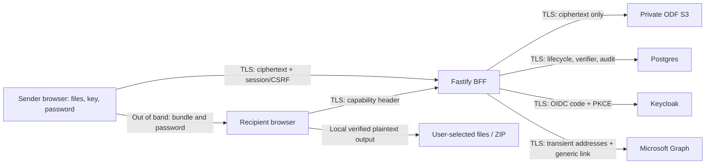

# Architecture, API, state machine and trust boundaries

One namespace and one tenant per deployment. The browser owns every plaintext operation. Fastify is a same-origin BFF and ciphertext proxy; Postgres stores lifecycle/identity/audit; a private ODF S3 bucket stores exactly one object per successfully uploaded repository. There is no document recovery path or administrator decryption function.

Trust delivered JavaScript, libsodium artifacts, browser, OS and user-selected output location. A malicious server delivering changed JavaScript can steal secrets and is outside this version's claim. Server observers can learn ciphertext size, timing, opaque IDs and authorized sender identity; size is not padded. No analytics, external scripts, embedded previews or persistent capability storage. Service administrators can revoke/delete and see lifecycle; they cannot decrypt existing objects using stored data alone.

Threats addressed: passive server/storage compromise, accidental logging of secrets, cross-sender access, unauthorized retrieval, malformed/tampered packages, offline password guessing mitigated by Argon2id/strong generated passwords, stale authorization and unsafe restore. Not addressed: compromised clients/application delivery, recipient forwarding, retained browser-local ciphertext/plaintext, traffic analysis, mail provider retention, screenshot/clipboard capture. Tests provide bounded evidence, not proof of zero exposure.

## API (same origin, no CORS)

All responses use no-store and no-referrer. JSON schemas disallow additional properties. Reject nonmatching Origin on unsafe cookie-authenticated endpoints and require session-bound CSRF header. Limits: JSON <=8192 bytes, link emails <=20 addresses each <=254 characters, capability 43 characters, IDs 32 lowercase hex, upload <=protocol ciphertext ceiling. Capability rate limiting is per replica; edge rate limits are an operator prerequisite for deployment-wide abuse control.

| Method/path                          | Input and authorization                                                | Result                                                                                                        |
| ------------------------------------ | ---------------------------------------------------------------------- | ------------------------------------------------------------------------------------------------------------- |
| GET /api/public-config               | public                                                                 | explicit brandName and supportText allowlist                                                                  |
| GET /auth/login                      | same-origin browser navigation                                         | server state + PKCE cookie, redirect to Keycloak                                                              |
| GET /auth/callback                   | code/state; one-use BFF transaction                                    | verify issuer, client audience, nonce, PKCE and required access-token client role; create session; redirect / |
| GET /api/session                     | session                                                                | sender id + CSRF, or 401                                                                                      |
| POST /api/logout                     | session + CSRF                                                         | delete session and cookie                                                                                     |
| GET /api/repositories                | required role + session                                                | own ID, createdAt, expiresAt, state, ciphertext size only; 100-row pages, optional opaque `cursor` ID         |
| POST /api/repositories               | session + CSRF, empty JSON                                             | new pending ID and one-time capability/link                                                                   |
| PUT /api/repositories/:id/ciphertext | owner + session + CSRF, binary, Content-Length and X-Ciphertext-SHA256 | streamed bounded multipart upload; 204 when uploaded/identical retry                                          |
| POST /api/repositories/:id/finalize  | owner + session + CSRF                                                 | atomic uploaded -> finalized; server clock +7 days; idempotent                                                |
| POST /api/repositories/:id/fail      | owner + session + CSRF                                                 | invalidate pending/uploading/uploaded, immediate retrieval denial                                             |
| POST /api/repositories/:id/revoke    | owner + session + CSRF                                                 | invalidate immediately, then cleanup                                                                          |
| POST /api/repositories/:id/reissue   | owner + session + CSRF                                                 | rotate capability verifier; return new capability once, old link immediately denied                           |
| POST /api/repositories/:id/email     | owner + session + CSRF; transient addresses and current capability     | synchronous Graph request, generic link + expiry only; accepted != delivered                                  |
| GET /api/recipient/:id               | Bearer capability                                                      | full ciphertext stream only while finalized, not expired, retrieval switch enabled                            |
| GET /health/live                     | no auth                                                                | process alive                                                                                                 |
| GET /health/ready                    | no auth                                                                | database reachable + retrieval deployment switch configured                                                   |

Link creation/reissue returns the capability once. It stays only in page/worker memory; a refresh loses it. Sender may reissue, atomically invalidating all previous links but preserving bundle/key and expiry. Email accepts the current capability transiently and checks its verifier. Addresses are never queued or persisted; an email failure leaves the repository intact and UI supports explicit retry. No Graph calls during local tests except local doubles.

## State machine and races

`pending -> uploading -> uploaded -> finalized -> revoked/expired`. `pending/uploading/uploaded -> failed/abandoned`; any active state may be revoked by owner. All changes use DB transactions/conditional updates and database clock. Uploaded is not retrievable. Finalize requires stored upload length/digest, observed S3 completion and matching upload lease. Completion is idempotent and expiry is assigned exactly once.

Upload reservation fixes expected ciphertext SHA-256 and length on the first attempt; all retries must match. At most four total attempts (initial +3 retries); browser waits 1,2,4 seconds, retries only transient HTTP/network errors and identical File snapshot bytes. Exhaustion marks failed; another delivery requires fresh ID/key. Server fences each upload using random lease and updates last_activity on received chunks. Concurrent attempts return conflict. Multipart failures abort and release lease; abandoned leases are swept after 60 minutes without activity. A late S3 complete cannot make a fenced/revoked row accessible; it becomes cleanup work.

Retrieval holds no long database snapshot. It checks DB status, expiry and capability before S3 open, before each emitted chunk, and on a short watchdog while blocked/backpressured. At expiry a local deadline aborts stream; on revocation a Postgres NOTIFY wakes every replica, with periodic DB checks as fallback. DB/listener uncertainty stops streams; no cache extends authorization. A DB change and network write cannot be globally atomic: bytes already handed to sockets/in transit cannot be recalled. Tests measure propagation bound; no instantaneous distributed revocation claim. Maximum authorization polling interval is 250 ms.

Cleanup runs every minute with idempotent deletes and explicit HEAD absence evidence. Rows retain invalidation time, attempts and confirmed absent time. Failures retry; unhealthy oldest pending deletion >23h raises readiness/monitor alert well before the 24h SLA. Sweep failed/revoked/expired/abandoned, stale multipart uploads and orphan objects. Orphans younger than 2h are protected against in-flight upload races. Bucket versioning, retention and replication must be absent; capability checks fail if gateway cannot establish compatibility. No bucket-backup claim inferred from S3 API results: operator attestations cover ODF/storage backups and replicas.

## Persisted fields: purpose and sensitivity

| Table/fields                                                                | Purpose                                                     | Classification                                                   |
| --------------------------------------------------------------------------- | ----------------------------------------------------------- | ---------------------------------------------------------------- |
| repositories.id, object_key                                                 | opaque operational routing, reconciliation                  | operational identifier, no plaintext derivation                  |
| sender_id                                                                   | authorization ownership and sender listing                  | personal identity, server-visible allowed                        |
| capability_hash                                                             | SHA-256 access verifier, rotated on reissue                 | credential verifier; never raw capability                        |
| status; created_at; finalized_at; expires_at; invalidated_at; last_activity | lifecycle and expiry                                        | operational metadata                                             |
| ciphertext_bytes; ciphertext_sha256                                         | bounds and identical-byte retries                           | ciphertext-derived metadata, no plaintext hash                   |
| upload_lease; multipart_id; upload_attempts                                 | fencing, resumeless retry/cleanup                           | opaque infrastructure metadata                                   |
| delete_attempts; deleted_at; last_delete_attempt                            | cleanup evidence and monitoring                             | operational metadata                                             |
| sessions.token_hash; csrf_hash; sender_id; expires_at                       | BFF session and CSRF verifiers, identity, absolute lifetime | infrastructure credential verifiers / identity                   |
| oidc_transactions.token_hash; state; nonce; verifier; expires_at            | short-lived PKCE exchange; deleted on use/expiry            | infrastructure auth secrets; not document secrets                |
| audit.repository_id; event; at; outcome; sender_id                          | allowlisted accountability; no recipient identity           | operational/security metadata, optional sender personal identity |
| settings.key, value                                                         | global retrieval_enabled restore fence                      | operational security setting                                     |
| schema_migrations.version                                                   | applied SQL schema version                                  | operational metadata                                             |

No filenames, MIME types, file count, individual sizes, plaintext hashes, keys, passwords, bundles, email addresses, provider tokens or provider error payloads are persisted. OIDC access/ID tokens exist only during callback. Role is validated at login and sessions expire absolutely after 15 minutes; Keycloak role changes apply at the next login, not instantly. No token refresh or persistent provider token storage.

## Outbound request inventory

| Destination             | Data/purpose                                                                                  | Sensitivity and restrictions                                                        |
| ----------------------- | --------------------------------------------------------------------------------------------- | ----------------------------------------------------------------------------------- |
| Keycloak discovery/JWKS | issuer metadata/signature keys                                                                | public; HTTPS, fixed configured issuer                                              |
| Keycloak token endpoint | code, PKCE verifier, confidential client credential                                           | auth secrets, TLS, no logs                                                          |
| Postgres                | above fields/query parameters                                                                 | TLS CA+hostname verification, never parameter logs                                  |
| ODF S3                  | opaque keys, ciphertext, SigV4 headers, multipart controls                                    | infrastructure credential/ciphertext; private bucket, CA verified                   |
| Entra token endpoint    | tenant/client credential; Graph scope                                                         | infrastructure secrets, transient access token                                      |
| Graph sendMail          | configured dedicated mailbox; transient recipient addresses, generic fragment link and expiry | personal data + capability; saveToSentItems false; no retries without sender action |
| Browser -> API          | identity cookies, CSRF, ciphertext or capability                                              | same-origin TLS; no plaintext/internal metadata/bundle/password                     |

Graph/Keycloak/S3 endpoint URLs are operator-controlled ConfigMap data, restricted to HTTPS. Runtime public configuration includes only brandName, supportText, emailEnabled and the local-only development indicator. Logs are constructed allowlisted events/counters; never log raw request objects, headers, URL queries, bodies, errors, DB params or provider responses. Ingress/storage/DB logging must be independently checked by the operator.

The public `/metrics` endpoint contains only aggregate pending-cleanup count and oldest invalidation age; it carries no identifiers, credentials or document metadata. `GET /api/repositories?cursor=<opaque-id>` paginates by stored creation time and ID without losing timestamp precision or crossing ownership boundaries.
